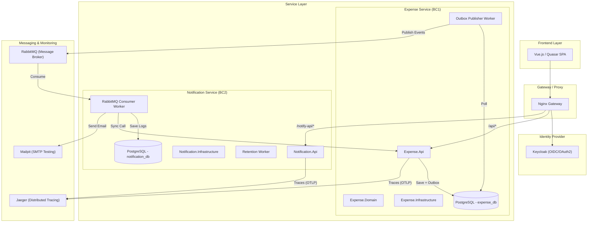
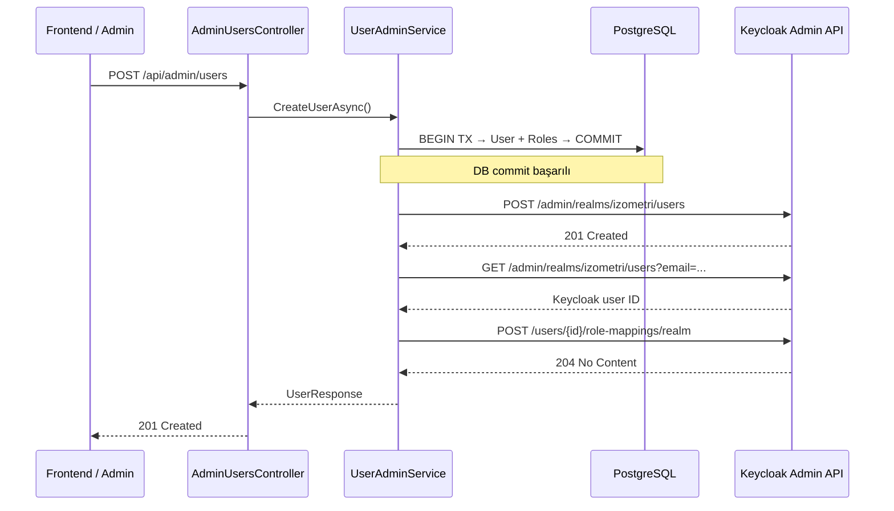

# 🏗️ Mimari Topoloji ve Sistem Tasarımı

Bu belge, **Izometri Harcama Yönetim Sistemi**'nin teknik mimarisini, veri akışını ve bileşenler arası iletişim modellerini detaylandırmaktadır.

## 📐 Sistem Mimarisi

Sistem, modern bulut tabanlı SaaS prensiplerine uygun olarak **Mikroservis Mimarisi** ve **Event-Driven Architecture (EDA)** yaklaşımlarıyla tasarlanmıştır.

## 🛠️ Teknik Stack

| Bileşen | Teknoloji | Açıklama |
| :--- | :--- | :--- |
| **Backend** | .NET 10 (C#) | Onion Architecture, DDD, CQRS |
| **Frontend** | Vue 3 + Quasar | SPA, Tailwind, Vite |
| **Auth** | Keycloak | OIDC, RBAC, Multi-Tenancy |
| **Veritabanı** | PostgreSQL 16 | Her servis için izole DB (Schema-per-service) |
| **Mesajlaşma** | RabbitMQ | Event-driven asenkron iletişim |
| **ORM** | EF Core 10 | Code-First, Global Query Filters |
| **Resilience** | Polly | Retry & Circuit Breaker |
| **Tracing** | OpenTelemetry | Dağıtık izleme (Jaeger) |

## 🛡️ Multi-Tenancy Yaklaşımı

Sistem **"Shared Database, Isolated Schema"** prensibiyle çalışır (bu case study'de basitlik için tek DB içinde tenant kolonları kullanılmıştır).

*   **Tenant İzolasyonu:** Her veritabanı sorgusunda `TenantId` bazlı global query filter uygulanır.
*   **Defense-in-Depth:** Hem API katmanında (JWT Claim) hem de veritabanı seviyesinde (Query Filter) tenant doğrulaması yapılır.

## 🔄 Kritik İş Akışları

### 1. Kullanıcı Senkronizasyonu (Keycloak Admin API)
Kullanıcı yönetimi işlemleri sırasında sistem, PostgreSQL veritabanı ile Keycloak arasında tam senkronizasyon sağlar.

### 2. Harcama Oluşturma ve Onay (Outbox Pattern)
Harcama kaydedildiğinde, aynı transaction içinde bir `OutboxMessage` oluşturulur. `OutboxPublisherWorker` bu mesajları asenkron olarak RabbitMQ'ya güvenli bir şekilde iletir. Bu sayede DB işlemi ile mesaj gönderimi arasında tutarlılık sağlanır.

### 2. Bildirim Gönderimi
`NotificationService`, RabbitMQ'dan gelen eventleri dinler. Bildirim içeriğini zenginleştirmek için `ExpenseService`'e senkron bir HTTP çağrısı yapar (resilience policy ile korunur) ve ardından E-posta/SMS gönderimini gerçekleştirir.

---
> [!NOTE]
> Bu mimari, yatayda ölçeklenebilir ve hata toleransı (fault-tolerance) yüksek bir yapı sunar.
