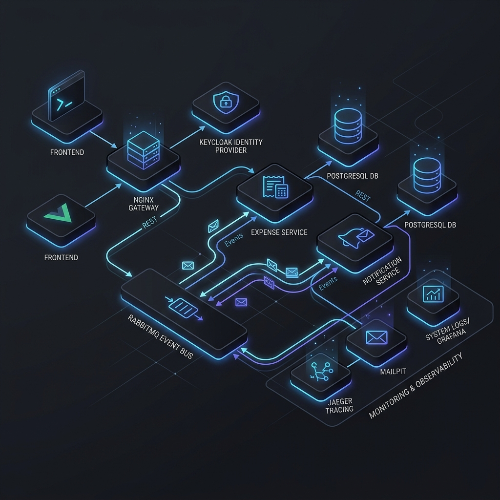

# İzometri Case Study - Kurumsal Harcama Yönetim Sistemi

Bu repository, İzometri backend case study için hazırlanmış multi-tenant harcama yönetim sistemidir.

Teslimat; 
* çalışır kaynak kod 
* Docker Compose ortamı 
* EF Core migrationları
* seed data ve bu README içindeki çalıştırma/test/topoloji bilgilerini içerir.

## İçerik

- İki bağımsız API: `ExpenseService.Api` ve `NotificationService.Api`
- Database per service: `expense_db` ve `notification_db`
- Multi-tenant veri izolasyonu: JWT `TenantId` claim + EF Core global query filter
- Roller: `Admin`, `HR`, `Personel`, servisler arası çağrılar için `Service`
- Asenkron iletişim: Expense outbox -> RabbitMQ -> Notification consumer
- Senkron iletişim: Notification Service -> Expense Service internal detail endpoint
- OAuth2/OIDC: Keycloak realm import ve API JWT Bearer doğrulama
- Logging/tracing: Serilog, Correlation ID, OpenTelemetry, Jaeger
- Testler: xUnit + Moq unit testleri, Testcontainers integration testleri

## Topoloji



Akış özeti:

1. Kullanıcı Keycloak'tan access token alır.
2. Frontend/Nginx istekleri Expense API ve Notification API'ye yönlendirir.
3. Expense API harcama işlemini kendi PostgreSQL veritabanına yazar.
4. Domain event, aynı transaction içinde `OutboxMessages` tablosuna eklenir.
5. Outbox publisher event'i RabbitMQ'ya publish eder.
6. Notification Service event'i consume eder.
7. Notification Service bildirim metnini zenginleştirmek için `GET /api/internal/expenses/{id}` endpoint'ine service token ile HTTP çağrısı yapar.
8. Bildirim kaydı Notification DB'ye yazılır, e-posta Mailpit'e gönderilir.

## Hızlı Başlangıç

Ön koşullar:

- Docker Desktop
- .NET 10 SDK
- Node/npm sadece frontend'i lokal geliştirmek için gerekir; Docker Compose için zorunlu değildir.

Temiz kurulum:

```powershell
docker compose down -v
dotnet restore Izometri.CaseStudy.slnx
dotnet build Izometri.CaseStudy.slnx
dotnet test Izometri.CaseStudy.slnx --no-build
docker compose up -d --build
```

Not:

- .NET servis Dockerfile'ları bilerek `mcr.microsoft.com` base image'larını kullanmıyor.
- Sebep, bazı makinelerde Docker'ın MCR'ye giderken `EOF` / `connection reset` alabilmesi; servisler bu yüzden `debian:12-slim` üstüne `packages.microsoft.com` üzerinden .NET 10 runtime/SDK kuruyor.
- Böylece case değerlendirmesinde `docker compose up -d --build` akışı, Docker Hub erişimi varken MCR erişimi bozuk olsa bile daha dayanıklı kalır.

Container durumunu kontrol:

```powershell
docker compose ps
docker compose logs expense-api --tail 100
docker compose logs notification-api --tail 100
```

Servis adresleri:

| Servis | Adres | Not |
| --- | --- | --- |
| Frontend | `http://localhost:3000` | Web arayüzü |
| Expense Swagger | `http://localhost:5001/swagger` | Harcama API |
| Notification Swagger | `http://localhost:5002/swagger` | Bildirim API |
| Keycloak | `http://localhost:18080` | Admin: `admin` / `admin` |
| RabbitMQ UI | `http://localhost:15673` | `izometri` / `Izometri2026!` |
| Mailpit | `http://localhost:8025` | Test e-postaları |
| Jaeger | `http://localhost:16686` | Distributed tracing |

## Test Kullanıcıları

Tüm seed kullanıcıların şifresi:

```text
Pass123!
```

| Tenant | E-posta | Rol | Amaç |
| --- | --- | --- | --- |
| `izometri` | `admin@izometri.com` | Admin | Tenant admin |
| `izometri` | `hr@izometri.com` | HR | Harcama onay/red |
| `izometri` | `personel@izometri.com` | Personel | Harcama talebi |
| `izometri` | `personel2@izometri.com` | Personel | İzolasyon testi |
| `test1` | `pattabanoglu@devrimmehmet.com` | Admin | Ana demo admin |
| `test1` | `devrimmehmet@gmail.com` | HR | Ana demo HR |
| `test1` | `devrimmehmet@msn.com` | Personel | Ana demo personel |
| `test1` | `personel2@test1.com` | Personel | Aynı tenant ek personel |
| `test2` | `admin@test2.com` | Admin | Farklı tenant admin |
| `test2` | `hr@test2.com` | HR | Farklı tenant HR |
| `test2` | `personel@test2.com` | Personel | Farklı tenant izolasyon testi |
| `test2` | `personel2@test2.com` | Personel | Farklı tenant ek personel |

Keycloak token alma örneği:

```powershell
$body = @{
  grant_type    = "password"
  client_id     = "expense-service"
  client_secret = "expense-service-client-secret"
  username      = "devrimmehmet@msn.com"
  password      = "Pass123!"
}

$token = (Invoke-RestMethod `
  -Method Post `
  -Uri "http://localhost:18080/realms/izometri/protocol/openid-connect/token" `
  -Body $body `
  -ContentType "application/x-www-form-urlencoded").access_token
```

## Temel Senaryo

Personel harcama oluşturur:

```powershell
Invoke-RestMethod `
  -Method Post `
  -Uri "http://localhost:5001/api/expenses" `
  -Headers @{ Authorization = "Bearer $token"; "X-Correlation-Id" = "manual-001" } `
  -ContentType "application/json" `
  -Body '{"category":"Travel","currency":"TRY","amount":3500,"description":"Müşteri ziyareti için ulaşım ve konaklama gideri"}'
```

Personel talebi submit eder:

```powershell
Invoke-RestMethod `
  -Method Put `
  -Uri "http://localhost:5001/api/expenses/{expenseId}/submit" `
  -Headers @{ Authorization = "Bearer $token"; "X-Correlation-Id" = "manual-001" }
```

HR veya Admin kullanıcısı kendi token'ı ile approve/reject endpointlerini kullanır:

```text
PUT /api/expenses/{expenseId}/approve
PUT /api/expenses/{expenseId}/reject
```

Bildirimler:

```text
GET http://localhost:5002/api/notifications
```

## EF Core Migrations ve Seed Data

Migrationlar teslimat için sade tutulmuştur: her servis için tek `InitialCreate` migration vardır.

Expense migration:

```text
src/Services/ExpenseService/ExpenseService.Infrastructure/Persistence/Migrations/*_InitialCreate.cs
```

Notification migration:

```text
src/Services/NotificationService/NotificationService.Infrastructure/Persistence/Migrations/*_InitialCreate.cs
```

API containerları açılışta migrationları otomatik uygular. Temiz veritabanıyla başlamak için:

```powershell
docker compose down -v
docker compose up -d --build
```

Seed data iki yerde tutulur:

- Expense DB seed: `ExpenseDbContext.Seed(...)`
- Keycloak seed: `deploy/keycloak/izometri-realm.json`

Expense DB ve Keycloak seed kullanıcıları aynı `UserId`, `TenantId`, email ve rol sözleşmesine göre hazırlanmıştır.

Yeni migration üretmek gerekirse:

```powershell
dotnet ef migrations add InitialCreate `
  --context ExpenseDbContext `
  --project src/Services/ExpenseService/ExpenseService.Infrastructure/ExpenseService.Infrastructure.csproj `
  --startup-project src/Services/ExpenseService/ExpenseService.Api/ExpenseService.Api.csproj `
  --output-dir Persistence/Migrations

dotnet ef migrations add InitialCreate `
  --context NotificationDbContext `
  --project src/Services/NotificationService/NotificationService.Infrastructure/NotificationService.Infrastructure.csproj `
  --startup-project src/Services/NotificationService/NotificationService.Api/NotificationService.Api.csproj `
  --output-dir Persistence/Migrations
```

## Testler

Unit testler:

```powershell
dotnet test tests/ExpenseService.UnitTests/ExpenseService.UnitTests.csproj
```

Integration testler:

```powershell
dotnet test tests/ExpenseService.IntegrationTests/ExpenseService.IntegrationTests.csproj
```

Tüm testler:

```powershell
dotnet test Izometri.CaseStudy.slnx
```

Test yapısı:

- `tests/ExpenseService.UnitTests`: xUnit + Moq; controller, validator, domain rule, JWT contract, notification handler ve `ExpenseAppService` unit testleri.
- `tests/ExpenseService.IntegrationTests`: Testcontainers ile PostgreSQL/RabbitMQ, Keycloak gated testleri ve live health/delivery testleri.

Son doğrulama durumu:

```text
Unit tests: 42 passed
Integration tests: 11 passed
Total: 53 passed, 0 failed
```

Live/Keycloak testleri varsayılan koşuda environment switch yoksa erken çıkar; Docker Compose ortamında manuel açılabilir:

```powershell
$env:RUN_KEYCLOAK_TESTS="1"
dotnet test tests/ExpenseService.IntegrationTests/ExpenseService.IntegrationTests.csproj --filter "FullyQualifiedName~KeycloakTokenIntegrationTests"

$env:RUN_LIVE_DELIVERY_TESTS="1"
dotnet test tests/ExpenseService.IntegrationTests/ExpenseService.IntegrationTests.csproj --filter "FullyQualifiedName~LiveDeliveryAndHealthTests"
```

## Case Gereksinimi Karşılığı

| Başlık | Durum | Karşılık |
| --- | --- | --- |
| Git repository | Hazır | Kaynak kod ve Docker dosyaları repository içinde |
| README | Hazır | Çalıştırma kılavuzu, test kullanıcıları, topoloji bu dosyada |
| docker-compose.yml | Hazır | API, DB, RabbitMQ, Keycloak, Mailpit, Jaeger, frontend |
| EF Migrations | Hazır | Expense ve Notification için tek `InitialCreate` migration |
| Seed Data | Hazır | Tenant, user, role ve örnek expense seed verileri |

## Notlar

- Docker Compose akışı Keycloak tabanlıdır; `Authentication:EnableLocalLogin=false`.
- Local fallback login kodu test/geliştirme için korunur, Docker teslimat akışında kapalı tutulur.
- Notification Service, Expense Service detay çağrısı için sadece `Service` rolüne açık internal endpoint kullanır.
- `X-Correlation-Id` HTTP header, RabbitMQ metadata/header, log scope ve OpenTelemetry tag olarak taşınır.

Hazırlayan: Devrim Mehmet Pattabanoğlu
